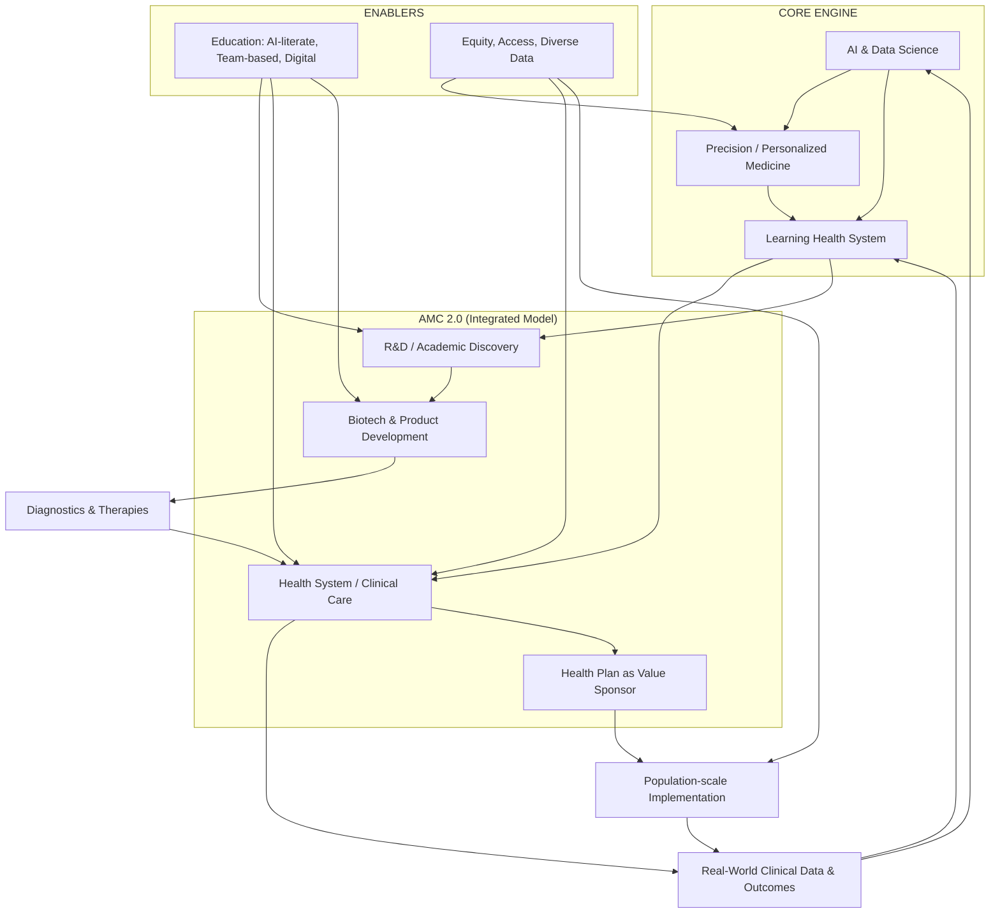

# Precision Medicine and AI: A Clear, Integrated Model

This document reframes the original notes into a clean, navigable Markdown that aligns tightly with the system diagram. It explains where AI meets precision/personalized medicine, and it organizes the ideas from most transformational to most traditional.

---

## 1) System Diagram (Overview)

The diagram below summarizes the integrated "AMC 2.0" model: a closed-loop, learning health system where AI and precision medicine are the core engine, tightly coupled to clinical care, research and development, the health plan, and biotech/product development — all enabled by education and equity.

### How to read the diagram
- Core engine: AI, precision medicine (PM), and the learning health system (LHS) reinforce each other.
- Closed loop: Care generates data that fuels AI and the LHS; discoveries flow to biotech and back to care as products.
- Health plan as value sponsor: The insurer scales implementation and provides population-level feedback and incentives.
- Enablers: Education builds AI-literate, team-based talent; equity ensures diverse data, access, and just outcomes.

---

## 2) Where AI and Precision/Personalized Medicine Meet

These are the main linkage points between modern AI/data science and precision medicine emphasized in the talk:

1. Clinicians must be AI- and data-literate to deliver precision care
   - Future physicians will manage larger data, analytics, decision support, and IT tools.
   - Expectation: every medical student gets AI/ML training; algorithms will guide diagnosis and treatment decisions.
   - AI is the “brain” that handles genomic, phenotypic, and social complexity to enable personalized choices.

2. Digitally intensive, decision-supported clinical practice = operational precision medicine
   - Precision medicine replaces one-size-fits-all; outcomes depend on genetics, phenotypes, and non-biological factors.
   - Clinicians will need AI-driven decision support that:
     - Combines genomic/omic data,
     - Pulls from the EHR and real-world outcomes,
     - Suggests tailored therapies and risk predictions at the bedside.

3. Learning health system to shrink the 14-year translation gap
   - Old model: discovery → ~14 years → guideline → ~14 years → widespread practice; COVID showed 14 months is possible.
   - Closed loop: care generates data → analytics (AI/ML) find patterns → rapidly tested in care → updated practice.
   - This is the AI + big data LHS concept applied to precision medicine.

4. AI for patient stratification in common chronic disease (beyond rare genetic disorders)
   - Real burden: heart failure, diabetes, resistant hypertension, atherosclerosis, neurodegeneration.
   - Strategy: stratify genetically and phenotypically; apply deep omics to understand non-responders.
   - Machine learning on multi-omics and clinical data discovers subtypes and targeted interventions.

5. AI-enabled continuous medical education and self-driven learning
   - The “all-knowing lecturer once a year” model is obsolete; knowledge refreshes every few months.
   - Education should be self-driven, digitally intensive (virtual platforms, simulations), and continuously updated.
   - AI systems can surface new evidence, personalize learning paths, and keep clinicians current on diagnostics and therapies.

6. AI to support equity-focused precision medicine
   - Outcomes are shaped by non-biological factors, structural racism, and access issues; trials often lack diversity.
   - AI on large, diverse datasets can reveal inequities, reduce bias, and redesign pathways and risk models for marginalized groups.
   - The goal is equitable deployment of precision treatments, not boutique care.

So, AI here is not a gimmick. It is an enabling layer that makes the precision-medicine vision workable at scale — in education, daily practice, research, and system-level learning.

---

## 3) Categorized Idea List: Transformational → Traditional

Below is a ranked list of the main ideas from the talk, starting with the most forward-looking and system-changing, moving toward more traditional concepts.

### A. Most Innovative / Transformational Ideas
1. AMC 2.0 and the “virtuous closed-loop” model
   - Replaces the fragmented model with a single, integrated engine linking:
     - Academia (research)
     - Health system (care delivery)
     - Insurer (payment and population data)
     - Biotech/industry (product development)
   - Goal: quickly turn discoveries into products, policies, and practices that improve outcomes and sustain the next wave of discovery.

2. Deep integration of clinical care and research into a learning health system
   - No rigid separation of “research here, care there.”
   - Every patient encounter becomes potential research data; research findings flow back to practice rapidly.
   - Bidirectional flow: bench ↔ bedside ↔ population, with real-time feedback instead of decades-long lag.

3. Precision medicine as the core model of care, especially for common chronic diseases
   - Move beyond a narrow focus on rare, mutation-driven disease.
   - Use genomics, phenotyping, and complex omics to stratify high-burden populations (e.g., heart failure, diabetes).
   - Outcomes:
     - Understand non-response to standard therapies,
     - Discover new targets and tailored regimens,
     - Reduce cost by preventing complications.

4. Digitally intensive, AI- and data-driven practice and training
   - Clinician workflow integrates big clinical and omics data, decision support, and AI/ML models.
   - Education reforms:
     - Universal AI/ML training for medical students,
     - VR and immersive tools,
     - Team-based, tech-enabled curricula over static memorization.

5. Health insurer as a proactive “value sponsor” and first adopter
   - Treat the health plan as:
     - Early implementer of locally developed diagnostics/therapies,
     - Population-scale test bed for effectiveness and cost-effectiveness,
     - Market shaper, influencing Medicare and other insurers.
   - Result: short-circuit the usual 14+14-year adoption treadmill.

6. Rewiring the product-development and tech transfer model
   - Current invention → disclosure → IP → licensing → product path is slow and barrier-filled.
   - Proposals:
     - Earlier recognition of inventions,
     - Flexible IP models that encourage entrepreneurship,
     - System-level support to bridge lab ideas to validated products (not just ad hoc PI help).

7. Building a regional biotech and product-development ecosystem around the AMC
   - Aim not just to discover, but to retain and grow downstream value locally.
   - Co-locate biotech with the academic engine, the health system, and the insurer.
   - Support a self-sustaining cycle of innovation and commercialization.

---

### B. Important but Enabling / Mid-Level Ideas
8. Reimagined education: patient-centered, team-based, inter-professional
   - Train physicians, nurses, pharmacists, dentists, therapists, etc., together in teams that reflect modern practice.
   - Emphasize patient-centered problem solving, prevention, personalized care, and competencies (not just time-based courses).
   - Education as a revenue generator via digital/remote and immersive platforms.

9. Equity, access, and structural racism as core design constraints
   - Outcomes shaped by social determinants, structural discrimination, and under-access to care/technology.
   - Precision medicine must improve equity, not worsen it.
   - Clinical trials must be more diverse; implementation must reflect community needs.

10. New models for continuously updating knowledge in a fast-changing world
    - You cannot rebuild curricula annually or re-teach every cohort manually.
    - Needed instead:
      - Self-driven learning,
      - Digital content streams that update as science changes,
      - AI-enabled systems to keep clinicians current across their careers.

11. Use clinical systems and insurers to fund basic and translational research
    - Traditional federal funding (NIH, etc.) is insufficient for the needed scale.
    - By converting innovation into products and care improvements that generate value, create new revenue to cross-subsidize foundational science.

---

### C. More Traditional / Status Quo Concepts (Still Part of the Story)
12. The tripartite mission: clinical care, research, education
    - Classic AMC identity, but often siloed:
      - Fragmented care (specialty-based, acute-focused),
      - Research that stops at publications rather than products,
      - Education focused on role prep over prevention, personalization, and continuous updating.

13. The traditional slow, fragmented healthcare innovation cycle
    - Basic research → trials → approval → slow adoption → scattered outcomes data.
    - Misaligned incentives and ownership (academia, pharma, hospitals, payers) create an inefficient 30-year cycle.

14. Conventional clinical trial and regulatory models
    - Randomized, highly controlled trials in non-representative populations,
    - Limited diversity,
    - Slow, expensive, poorly connected to real-world practice.
    - COVID showed a more agile model is possible when the system aligns.

15. Traditional views of IP and tech transfer
    - University-centered IP ownership,
    - Risk-averse tech transfer with limited resources,
    - Patent-first mentality even when product strategy is unclear,
    - Slow movement from discovery to development.
